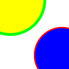

# veg
SVG parser and renderer implemented in Go

## Example

`circle.svg`

```xml
<svg width="100" height="100">
  <circle cx="15" cy="0" r="50" stroke="00FF00" stroke-width="4" fill="FFFF00" />
  <circle cx="90" cy="80" r="40" stroke="F00" stroke-width="2" fill="00F" />
</svg>
```

```
./veg circle.svg
```

`out.png`



## VEctor Graphics parser

*veg* is short: 324 lines of code as of today.

It is able to draw circles, paint them using hex colors, and support strokes.  It is designed to be easily extended with more shapes.

It is as a toy parser, used to demonstrate how to implement a simple lexer/parser.  
SVG is great to learn as it gives a visual result with very little logic to implement.

veg outputs PNG images.

## Installation

```
go get github.com/lysrt/veg
```